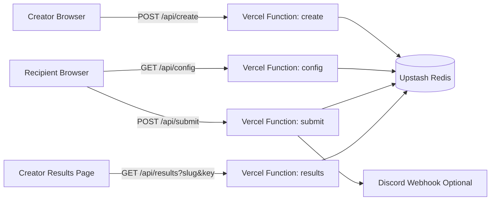
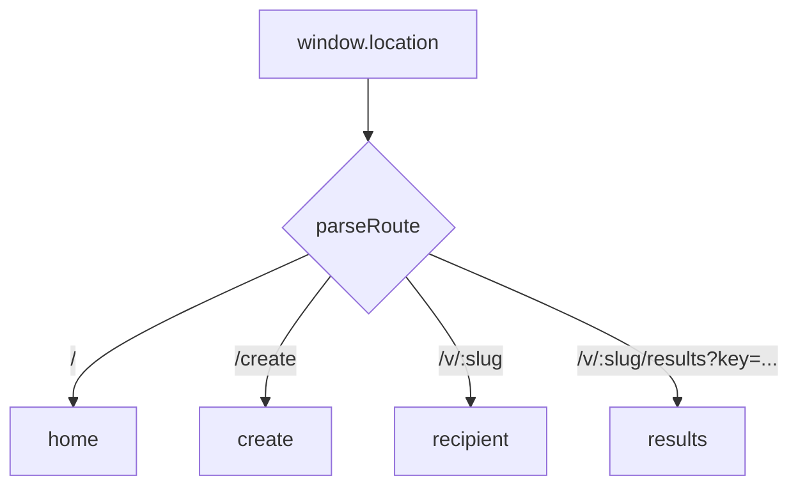
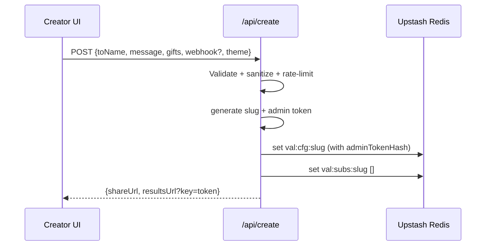
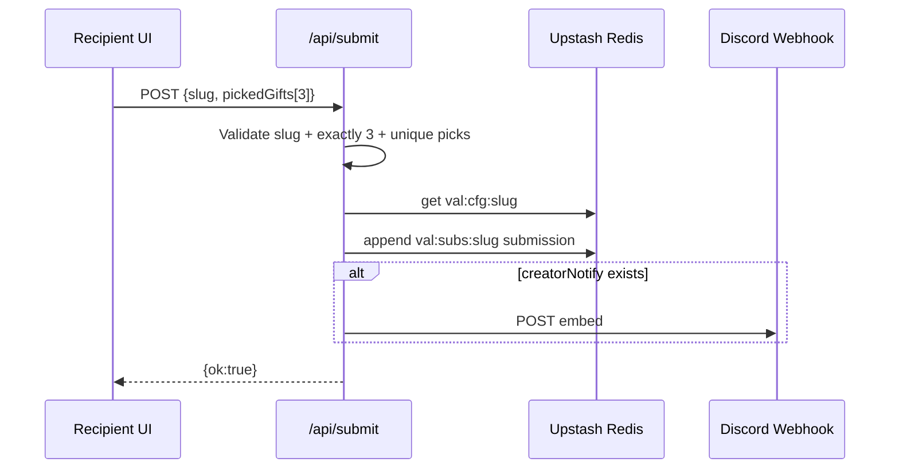

# Gift-land Architecture Deep Dive (With Diagrams + Code)

This is a technical breakdown of how Gift-land is structured and why specific implementation choices were made.

## 1) System Overview



## 2) Route Model

The app uses a lightweight custom SPA router rather than an external routing framework.



Why this works:
- only 4 route states
- zero dynamic nesting complexity
- lower bundle and mental overhead

## 3) Storage Model

Redis keys are intentionally explicit:

- `val:cfg:${slug}` -> creator configuration + admin token hash
- `val:subs:${slug}` -> array of recipient submissions (capped)

```mermaid
flowchart TB
  CFG[val:cfg:abc123]
  SUBS[val:subs:abc123]

  CFG --> CFG1[toName]
  CFG --> CFG2[message]
  CFG --> CFG3[gifts[]]
  CFG --> CFG4[creatorNotify optional]
  CFG --> CFG5[adminTokenHash]
  CFG --> CFG6[theme]

  SUBS --> S1[submission id]
  SUBS --> S2[pickedGifts 3]
  SUBS --> S3[pickedAt]
```

## 4) Creator Flow Sequence



## 5) Recipient Submit Sequence



## 6) Security Controls

### Input controls
- Text sanitization and max length constraints
- URL validation (`http/https` only)
- Slug format validation
- gift count bounds on create and submit

### Access controls
- results endpoint requires `slug + key`
- key is hashed (`sha256`) in storage
- timing-safe hash comparison

### Abuse controls
- per-endpoint in-memory rate limiting
- minimum request interval
- `Retry-After` headers for backoff signaling

## 7) Code Snippets

### 7.1 Create endpoint: generate one-time admin key and store only hash

```ts
// api/create.ts
const adminToken = generateToken(32);
const adminTokenHash = hashToken(adminToken);

await kvSet(`val:cfg:${slug}`, {
  slug,
  toName,
  message,
  gifts,
  creatorNotify,
  createdAt,
  adminTokenHash,
  theme
});

res.status(200).json({
  ok: true,
  slug,
  shareUrl: `/v/${slug}`,
  resultsUrl: `/v/${slug}/results?key=${adminToken}`
});
```

### 7.2 Results endpoint: verify key using timing-safe compare

```ts
// api/results.ts
const hashed = hashToken(key);
if (!timingSafeEqualHex(config.adminTokenHash, hashed)) {
  res.status(401).json({ ok: false, error: 'Invalid or missing key' });
  return;
}
```

### 7.3 Submit endpoint: enforce exactly 3 unique selections

```ts
// api/submit.ts
if (picks.length !== 3) {
  res.status(400).json({ ok: false, error: 'Exactly three gifts are required' });
  return;
}

for (const pick of picks) {
  const id = sanitizeText(pick?.id ?? '', 40);
  const gift = id ? pickGift(config.gifts, id) : null;
  if (!gift) {
    res.status(400).json({ ok: false, error: 'Invalid gift selection' });
    return;
  }
  if (pickedGifts.some((existing) => existing.id === gift.id)) {
    res.status(400).json({ ok: false, error: 'Duplicate gifts not allowed' });
    return;
  }
  pickedGifts.push(gift);
}
```

### 7.4 Reliability pattern: local retry queue with exponential backoff

```ts
// src/lib/submission-queue.ts
function getBackoffDelayMs(attempts: number, options?: QueueOptions) {
  const base = options?.baseDelayMs ?? 20_000;
  const max = options?.maxDelayMs ?? 5 * 60_000;
  const delay = base * Math.pow(2, Math.max(0, attempts - 1));
  return Math.min(delay, max);
}
```

## 8) Testing Strategy

Creator flow behavior is tested with Vitest and a mocked Redis layer:

- create -> link generation + storage
- config -> public fields only (no sensitive leak)
- submit -> persistence + optional webhook call
- results -> hashed key authentication

This keeps tests deterministic while still covering meaningful API behavior.

## 9) Tradeoffs and Future Improvements

Current tradeoffs:
- in-memory rate limiter is per-instance, not globally distributed
- submissions stored as arrays (simple, but not ideal for analytics queries)
- no formal observability pipeline yet

Next upgrades:
1. move rate limiting to Redis-based counters for global consistency
2. store submissions in a query-friendly structure (or SQL)
3. add structured logs + trace IDs for endpoint diagnostics
4. add expiration/TTL lifecycle controls for old gift pages

## 10) Why This Architecture Worked

This architecture fit the scope because it optimized for:
- fast product iteration
- clear boundaries between public and private data
- enough security/reliability for real users
- low operational overhead

For small-to-medium interactive products, this combination is often a better choice than a larger framework stack introduced too early.
