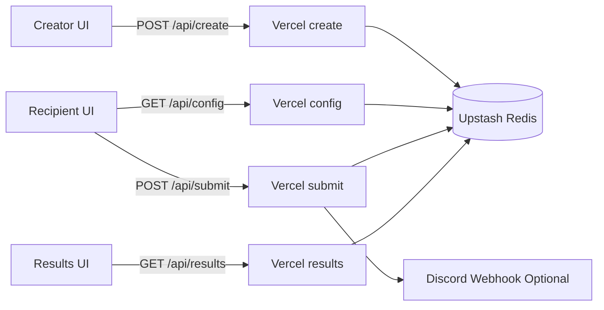
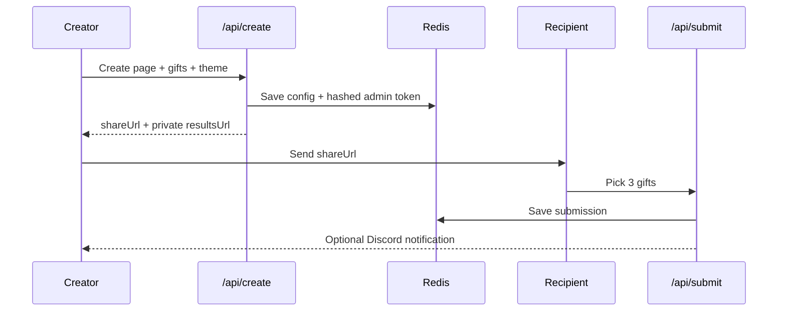

# I Built Gift-land Because Asking "What Do You Want?" Feels Hard

I am introverted, and gift-giving has always been weirdly stressful for me.

Not the buying part. The asking part.

"What do you want?" sounds simple, but I overthink it every time. Is it too direct? Does it kill the surprise? Does it sound lazy? So I do what a lot of quiet overthinkers do: I guess.

Sometimes the guess lands. Sometimes it does not.

After enough polite smiles and "this is lovely" moments, I stopped treating this as a personality quirk and treated it as a systems problem.

Could I design a flow where I can still be thoughtful, the other person still gets real choice, and nobody has to do the awkward preference interview?

That question became **Gift-land**.

## The product loop I wanted

I did not want a giant app. I wanted one loop that reduces social friction:

1. Creator curates a short list of gifts.
2. Creator shares one link.
3. Recipient picks exactly 3 gifts they actually want.
4. Creator gets private results and can act.

Emotionally, it preserves the care.
Technically, it turns ambiguity into a clear workflow.

## The web tools I used as a solo builder

I picked tools I can maintain without a team:

- React + TypeScript + Vite
- Tailwind CSS
- Vercel serverless functions
- Upstash Redis
- Discord webhooks
- Vitest for API behavior tests

This stack is not flashy, but it has a good signal-to-noise ratio. I can ship fast, reason about failure modes, and still keep the architecture clean.

## Architecture (small surface area, clear boundaries)



The important part is not the diagram. It is the boundaries:

- `api/config` only returns public recipient-safe data
- `api/results` only returns private creator data after key verification
- `api/submit` enforces domain invariants (exactly 3 unique picks)

As a senior-engineering habit, I try to put trust boundaries in endpoint design first, not in afterthought conditionals.

## Implementation details that matter

### 1) Private results are defensible, not just hidden

When a page is created, I issue an admin token once and store only its hash.

```ts
// api/create.ts
const adminToken = generateToken(32);
const adminTokenHash = hashToken(adminToken);

await kvSet(`val:cfg:${slug}`, {
  slug,
  toName,
  message,
  gifts,
  creatorNotify,
  createdAt,
  adminTokenHash,
  theme
});
```

On read, I hash incoming key and compare using timing-safe equality.

```ts
// api/results.ts
const hashed = hashToken(key);
if (!timingSafeEqualHex(config.adminTokenHash, hashed)) {
  res.status(401).json({ ok: false, error: 'Invalid or missing key' });
  return;
}
```

For a side project, this is a strong security baseline with low complexity overhead.

### 2) Domain invariants are explicit in API logic

I do not let the UI be the only enforcement point.

```ts
// api/submit.ts
if (picks.length !== 3) {
  res.status(400).json({ ok: false, error: 'Exactly three gifts are required' });
  return;
}

if (pickedGifts.some((existing) => existing.id === gift.id)) {
  res.status(400).json({ ok: false, error: 'Duplicate gifts not allowed' });
  return;
}
```

This keeps behavior predictable even if clients change.

### 3) Reliability is treated as workflow, not one request

Network failures happen. User intent should survive them.

```ts
// src/lib/submission-queue.ts
function getBackoffDelayMs(attempts: number, options?: QueueOptions) {
  const base = options?.baseDelayMs ?? 20_000;
  const max = options?.maxDelayMs ?? 5 * 60_000;
  const delay = base * Math.pow(2, Math.max(0, attempts - 1));
  return Math.min(delay, max);
}
```

A local retry queue with backoff converts transient outages from data loss into delayed success.

## End-to-end flow



For me, this changed the emotional dynamic. I am no longer forcing a conversation style that drains me. I can still show care, and the recipient still has control.

## Tradeoffs I made on purpose

Every side project architecture is a set of compromises. These are mine:

1. **In-memory rate limiting in functions**  
It is simple and fast to ship, but not globally consistent across instances. For the current scale, acceptable. For bigger traffic, I would move rate limiting to Redis.

2. **Array-based submission storage**  
Appending into arrays is easy to implement, but not ideal for analytics-heavy querying later. If this grows, I would move submissions into a query-first schema.

3. **Custom client router**  
For four route states, it is light and clear. If route complexity grows (nested layouts, loaders, richer URL state), a full router library becomes worth it.

4. **Discord as notification channel**  
Great for quick creator feedback, but it ties the product to one external channel model. Long term, email and native in-app notifications would reduce that coupling.

Tradeoffs are not failures. They are explicit scope control.

## What I learned building this

I learned that emotional products need engineering discipline more than clever features.

When the user intent is vulnerable, "mostly works" is not good enough. If private links leak, if a submission disappears, or if selection rules are inconsistent, trust collapses fast.

The most useful senior-level pattern here was writing down non-negotiable invariants early:

- results require key verification
- config endpoint never leaks private fields
- recipient submissions must be exactly 3 unique items
- failures must degrade to retry, not silent drop

Once those invariants were explicit, implementation got easier. API design, tests, and UI behavior aligned around the same contract.

I also relearned a practical truth: side projects improve when you optimize for maintainability over cleverness. A small, boring stack with sharp boundaries let me build something that is both personal and technically respectable.

## Why I am sharing this

Gift-land started as a workaround for my own social friction. Now it helps me, and hopefully others like me, give better without turning every gift into an awkward interview.

If you are building a side project, pick a friction you actually live with. Then engineer the trust model as carefully as the UI.

That is where useful products come from.
