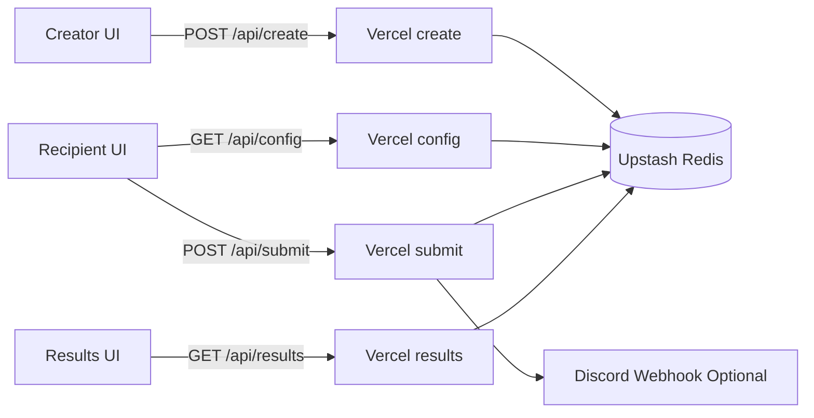
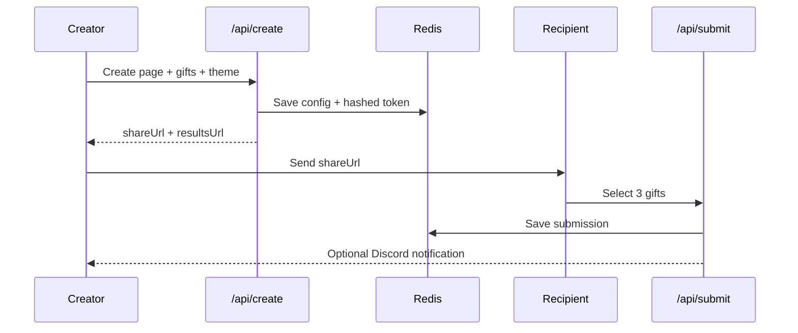

# I Built Gift-land Because I’m Bad at Asking People What They Want

I’m the kind of person who will rehearse a simple message three times before sending it.

So when birthdays or special days come up, asking “What do you want?” feels weirdly hard. I worry it will sound lazy. I worry it will ruin the surprise. I worry I’ll make it awkward.

Most of the time, I avoid the question, guess a gift, and hope for the best.

Sometimes it works. Sometimes you get that polite smile that says “thank you” while quietly saying “this isn’t really me.”

After enough of those moments, I stopped thinking, “I should just get better at this socially,” and started thinking, “maybe this is a product problem.”

That’s where **Gift-land** came from.

## The problem I wanted to solve

I didn’t want a giant gifting platform. I wanted one tiny loop that removed social friction:

1. I curate a shortlist of gifts.
2. I send one link.
3. They pick the three they actually want.
4. I still feel thoughtful, and they still get agency.

That was the whole goal: keep the care, remove the awkwardness.

## The tools I used to build it quickly

I built this as a side project with tools I could maintain solo:

- React + TypeScript + Vite
- Tailwind CSS
- Vercel serverless functions
- Upstash Redis
- Discord webhooks
- Vitest for API testing

Nothing fancy. Just tools that let me ship without burning out.

## What Gift-land does

- `/create` -> creator builds a custom gift page (3-12 gifts, message, theme)
- `/v/:slug` -> recipient picks exactly 3 gifts
- `/v/:slug/results?key=...` -> private creator results page

Here’s the architecture in one picture:



I kept each endpoint focused:

- `api/create` stores creator config and returns links
- `api/config` exposes only recipient-safe data
- `api/submit` validates picks and stores submission
- `api/results` verifies private key and returns submissions

## One security choice I didn’t want to compromise on

If creator results are private, they should be private for real.

When creating a page, I generate a key for the results URL, but I only store its hash in Redis:

```ts
// api/create.ts
const adminToken = generateToken(32);
const adminTokenHash = hashToken(adminToken);

await kvSet(`val:cfg:${slug}`, {
  slug,
  toName,
  message,
  gifts,
  creatorNotify,
  createdAt,
  adminTokenHash,
  theme
});
```

Then `/api/results` hashes the incoming key and compares it with timing-safe equality:

```ts
// api/results.ts
const hashed = hashToken(key);
if (!timingSafeEqualHex(config.adminTokenHash, hashed)) {
  res.status(401).json({ ok: false, error: 'Invalid or missing key' });
  return;
}
```

For a small side project, this gives me a security baseline I can trust.

## How the flow feels end-to-end



This is what changed for me personally: I no longer need a stressful “what do you want?” conversation to still give someone something they’ll actually like.

## Tradeoffs I made on purpose

1. **In-memory rate limiting**
It’s easy to ship and good enough at current scale, but it isn’t globally consistent across serverless instances.

2. **Array-based submission storage**
Simple and fast for now, weaker for future analytics-heavy queries.

3. **Custom SPA router**
Great while routes stay small. If route complexity grows, I’ll likely move to a full router.

4. **Discord-first notifications**
Fastest way to close the creator feedback loop, but it couples notifications to one channel.

I’m okay with these tradeoffs because they were explicit. They helped me finish and ship.

## What I learned while building this

I learned that “small” products are still emotional systems.

On paper, this app is just forms, links, validation, and storage. In practice, it’s about reducing a kind of social pressure that a lot of people quietly deal with.

That changed how I prioritized work.

I cared more about reliability than feature count. A missed submission hurts more than missing one extra customization option. I cared more about trust than novelty. If private results feel leaky, the product fails even if the UI is beautiful.

I also learned that constraints are useful. Because I treated this as a side project with limited time, I chose maintainable tools and made tradeoffs early instead of pretending I had infinite runway. That made the project smaller, but better.

## Why I’m sharing this

Gift-land started as something I built for myself because I’m introverted and overthink social asks.

Now it helps me show care without friction, and I think it can help other people like me do the same.

If you’re building your own side project, start with a real human friction you personally understand. Use tools you can sustain. Pick tradeoffs on purpose. Ship sooner than your inner perfectionist wants.

That’s usually enough to build something genuinely useful.
