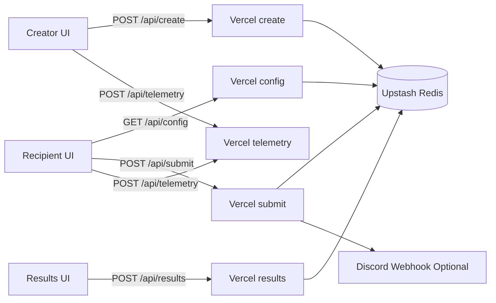
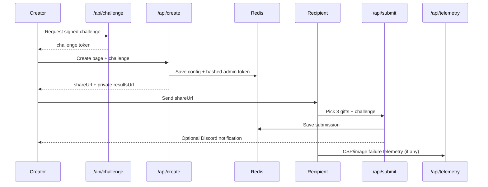

# I Built an App So I’d Never Have to Ask “What Gift Do You Want?” Again

Gift-giving stressed me out for one reason: asking.

“What do you want?” sounds simple. For me, it never was.

As an introvert, I overthink tone, timing, and whether the question kills the surprise. So I’d guess. Sometimes I got it right. Sometimes I got the polite smile.

After enough misses, I stopped treating this as personality and treated it as architecture.

Could I design a flow that keeps care, keeps surprise, and removes the awkward preference interview?

That became **Gift-land**.

## The Product Loop Was Tiny, But Non-Negotiable

I didn’t want a huge app.

I wanted one reliable loop:

1. Creator curates a short list.
2. Creator shares one link.
3. Recipient picks exactly 3 gifts.
4. Creator gets private results.

Emotionally, it keeps the gesture personal.

Technically, it turns ambiguity into a contract.

## Stack I Could Operate Alone

- React + TypeScript + Vite
- Tailwind CSS
- Vercel serverless functions
- Upstash Redis
- Discord webhooks (optional creator notify)
- Vitest + CI

No fancy platform story.

Just tools I can debug at 1am.

## Architecture First, UI Second



The boundaries matter more than the components:

- `api/config` only returns recipient-safe data.
- `api/results` is private and key-verified.
- `api/submit` enforces domain invariants (exactly 3 unique picks).
- `api/telemetry` only accepts whitelisted client diagnostics events.

## Post-Launch Hardening: What Changed

Shipping the first version was step one.

The real work was hardening trust.

### 1) Signed anti-abuse challenges

Instead of trusting a static client header, clients fetch a short-lived signed challenge from `GET /api/challenge`.

```ts
// src/lib/api.ts
const response = await fetch('/api/challenge');
if (!response.ok || !data.ok || typeof data.challenge !== 'string') return {};
return { 'x-app-challenge': data.challenge };
```

That challenge is verified server-side with IP + user-agent binding and expiration checks.

### 2) Structured server observability

I added structured API events across create/submit/challenge/legacy-submit so failures are queryable instead of anecdotal.

```ts
// api/submit.ts
logApiEvent(req, 'submit.creator_webhook_failed', {
  slug,
  status: webhookResponse?.status ?? 'network_error'
}, 'warn');
```

### 3) Client diagnostics for real production pain

The browser now reports:

- challenge failures
- CSP violations
- image load failures

That data flows into `POST /api/telemetry` with event allowlisting and rate limits.

### 4) Domain logic extracted from page code

I pulled create-form validation rules into a dedicated module so UI doesn’t own business invariants.

It’s a small refactor, but it lowers future change risk.

### 5) CI now gates contract behavior

I added a dedicated contract test target for creator flow, and CI runs it explicitly.

That catches security/regression drift before deploy.

## Security Model: Practical but Serious

Private results are protected by one-time token issuance with hash-only storage.

```ts
// api/create.ts
const adminToken = generateToken(32);
const adminTokenHash = hashToken(adminToken);
```

Webhook URLs are encrypted before storage, not kept as plaintext in KV.

Rate limiting is hybrid:

- shared (Redis-backed) when available
- local fallback
- fail-closed in production on backend limiter failure where configured

That’s the difference between “works locally” and “defensible in prod.”

## End-to-End Flow



## Tradeoffs I Made on Purpose

Every side project is a tradeoff set, not a purity contest.

1. **Direct third-party image loading (`img-src https:`)**  
   Maximum creator flexibility, but less control than a proxy/CDN model.

2. **Redis + in-memory limiter fallback**  
   Good resilience and speed, but still operationally simpler than full global abuse infra.

3. **Array-based submission persistence**  
   Fast append/read path now, weaker for advanced analytics later.

4. **Discord as the first-class notify channel**  
   Practical and fast, but channel-coupled by design.

I documented these tradeoffs in an ADR, then added KPI/SLO tracking, a threat model, and runbooks so decisions stay explicit as the project grows.

## What I Learned Building This

For products with emotional stakes, reliability is part of UX.

If challenge flow breaks, people assume the product is flaky.

If image previews fail silently, confidence drops before they even click submit.

If result privacy is weak, the whole experience feels unsafe.

The biggest engineering shift was treating this side project like an operated system, not a code artifact:

- observability signals with action paths
- contract tests in CI
- explicit SLOs and error budgets
- documented incident and rollback playbooks

That’s the part I wish more “build in public” posts emphasized.

Shipping is moment one.

Operating is the real product.

## Closing

Gift-land started as a workaround for my own social friction.

Now it helps me stay thoughtful without forcing the kind of conversation that drains me.

If you’re building your own side project, start from friction you genuinely live with.

Then design for trust, and keep hardening after launch.

People don’t remember your stack.

They remember whether your system kept its promise.
