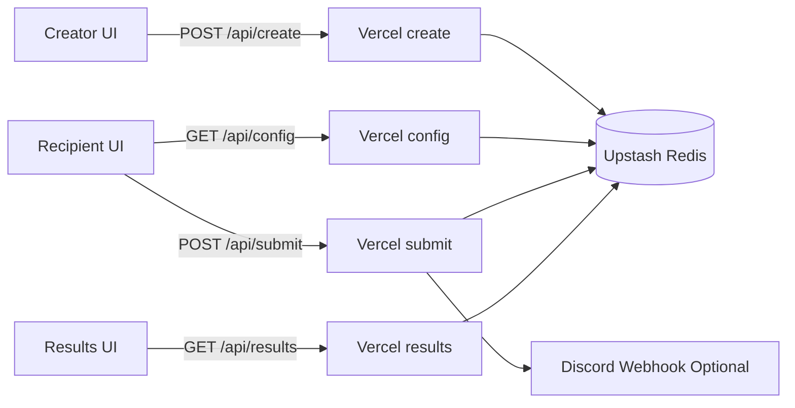
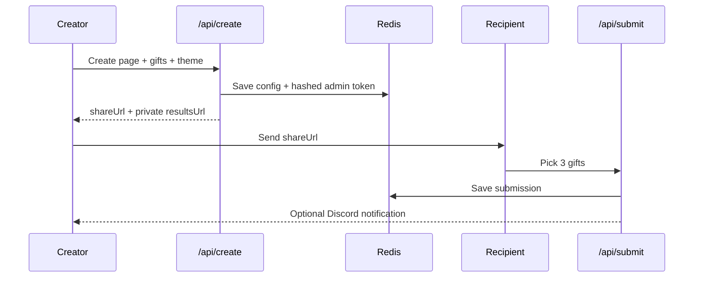

# I Built an App So I’d Never Have to Ask “What Gift Do You Want?” Again

Gift-giving has always been stressful for one reason: asking.

"What do you want?" should be easy. For me, it never is.

I overthink tone, timing, and whether it ruins the surprise. So I do what many quiet overthinkers do: I guess.

Sometimes the guess works.

Sometimes it gets the polite smile.

After enough misses, I stopped treating this as a personality quirk and treated it as a systems problem.

Could I design a flow that keeps the care, keeps the surprise energy, and removes the awkward preference interview?

That question became **Gift-land**.

## The Real Problem Was Friction

I didn’t want a big app.

I wanted one loop:

1. Creator curates a short gift list.
2. Creator shares one link.
3. Recipient picks exactly 3 gifts.
4. Creator gets private results.

Emotionally, this preserves thoughtfulness.

Technically, it converts ambiguity into a clear contract.

## The Side-Project Stack That Let Me Ship

I chose tools I can maintain alone:

- React + TypeScript + Vite
- Tailwind CSS
- Vercel serverless functions
- Upstash Redis
- Discord webhooks
- Vitest

No heroics.

Just a reliable stack with fast iteration and understandable failure modes.

## Architecture: Small Surface, Hard Boundaries



The diagram matters less than the boundaries:

- `api/config` returns recipient-safe public data only
- `api/results` returns creator-private data only after key verification
- `api/submit` enforces domain invariants (exactly 3 unique picks)

That’s a senior-engineering habit I trust: put boundaries in API design first, not in scattered conditionals later.

## Security Baseline: Defensible, Not Just Hidden

Private results should be private by design.

When a page is created, I issue an admin token once and store only the hash.

```ts
// api/create.ts
const adminToken = generateToken(32);
const adminTokenHash = hashToken(adminToken);

await kvSet(`val:cfg:${slug}`, {
  slug,
  toName,
  message,
  gifts,
  creatorNotify,
  createdAt,
  adminTokenHash,
  theme
});
```

On read, incoming key is hashed and compared with timing-safe equality.

```ts
// api/results.ts
const hashed = hashToken(key);
if (!timingSafeEqualHex(config.adminTokenHash, hashed)) {
  res.status(401).json({ ok: false, error: 'Invalid or missing key' });
  return;
}
```

This gives strong protection for a side project without pulling in a full auth system.

## Domain Rules Belong on the Server

UI rules are convenience.

API rules are truth.

```ts
// api/submit.ts
if (picks.length !== 3) {
  res.status(400).json({ ok: false, error: 'Exactly three gifts are required' });
  return;
}

if (pickedGifts.some((existing) => existing.id === gift.id)) {
  res.status(400).json({ ok: false, error: 'Duplicate gifts not allowed' });
  return;
}
```

That keeps behavior stable even as clients evolve.

## Reliability: Preserve Intent When Networks Fail

I stopped treating submission as one request/response event.

I treated it as a retriable workflow.

```ts
// src/lib/submission-queue.ts
function getBackoffDelayMs(attempts: number, options?: QueueOptions) {
  const base = options?.baseDelayMs ?? 20_000;
  const max = options?.maxDelayMs ?? 5 * 60_000;
  const delay = base * Math.pow(2, Math.max(0, attempts - 1));
  return Math.min(delay, max);
}
```

A local retry queue with exponential backoff means transient failures degrade to delayed success, not silent loss.

## End-to-End Flow



For me, this changed the emotional dynamic.

I no longer force a conversation style that drains me.

I can still be thoughtful.

The recipient still has control.

## Tradeoffs I Made on Purpose

Every side-project architecture is a compromise set.

1. **In-memory rate limiting in functions**  
Simple and fast, but not globally consistent across instances. If traffic grows, move this to Redis.

2. **Array-based submission storage**  
Easy append/read model now, weaker for analytics-heavy querying later.

3. **Custom client router**  
Great for four route states, less great once routing complexity expands.

4. **Discord as notification channel**  
Fast to implement, but channel-coupled.

Tradeoffs are not failures.

They are scope decisions with migration paths.

## What I Learned (As An Engineer, Not Just A Builder)

Emotional products fail for technical reasons.

If private links leak, trust dies.
If submissions disappear, trust dies.
If rules are inconsistent, trust dies.

The biggest win was writing non-negotiable invariants early:

- results require key verification
- config cannot leak private fields
- submissions must be exactly 3 unique picks
- failures retry instead of dropping intent

Once those were explicit, everything got easier.

API design got cleaner.
Tests got sharper.
UI behavior got more predictable.

The lesson for me: senior engineering on side projects is less about “advanced architecture” and more about disciplined boundaries.

## Closing

Gift-land started as a workaround for my own social friction.

Now it helps me give better without forcing awkward conversations.

If you’re building a side project, start with friction you actually live with.

Then engineer trust as carefully as you engineer features.

People remember how your product made them feel.

They keep using it when the system proves it deserves that trust.
